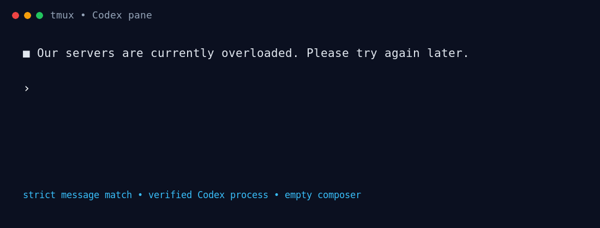

# tmux-codex-auto-continue

[](https://github.com/yeahdongcn/tmux-codex-auto-continue/actions/workflows/ci.yml)
[](https://github.com/yeahdongcn/tmux-codex-auto-continue/releases/latest)
[](LICENSE)

An unofficial Linux tmux watcher that recovers interrupted Codex CLI turns,
selected retry states, and Codex's **Keep waiting** safety-buffering choice.

It watches only verified Codex panes and submits a guarded recovery command with
a real Enter when the evidence is strong enough. Ordinary interrupted turns use
`Continue`; a retry-limited recoverable Goal uses `/goal resume`, while every
other current 429 uses `Continue`. It never creates, renames, restarts, closes,
or kills a tmux session or pane; it only injects documented input into an
already-running Codex pane.

> [!WARNING]
> This plugin injects keys into a verified Codex pane. Retrying an interrupted
> turn or accepting **Keep waiting** can keep a session running and consume
> additional time or tokens. Read the behavior and safety sections below, and
> use the toggle key (`prefix` + `A` by default) as the emergency stop. This
> automation does not bypass Codex/OpenAI safety controls or grant Trusted
> Access; a retried request can be rejected again.



The animation shows the two recovery paths; it is an illustration of the
verified input sequence, not a promise that every Codex layout is supported.

## Quick install

Pinned one-line installer (v0.2.3):

```sh
curl --proto '=https' --tlsv1.2 -fsSL \
  https://raw.githubusercontent.com/yeahdongcn/tmux-codex-auto-continue/v0.2.3/install.sh | sh
```

Using TPM? See [TPM installation](#tpm-installation) for the opt-in config
snippet.

For an audit-first install, download and inspect the script before running it:

```sh
curl --proto '=https' --tlsv1.2 -fsSLo /tmp/tmux-codex-install.sh \
  https://raw.githubusercontent.com/yeahdongcn/tmux-codex-auto-continue/v0.2.3/install.sh
less /tmp/tmux-codex-install.sh
sh /tmp/tmux-codex-install.sh
```

Release checksums for the installer, uninstaller, and watcher are in
[`SHA256SUMS`](SHA256SUMS). The checksum file is a review aid, not a signature;
verify it against a trusted release page before relying on it.

The one-liner executes the installer fetched over HTTPS from the versioned tag;
the installer itself is not independently signed. It downloads the watcher,
verifies its embedded SHA-256, runs its self-test, and uses no `sudo`. The
default install immediately enables the watcher, adds or updates one marked
block in `~/.tmux.conf`, sources that config, and refreshes only the watcher.
The tmux server, sessions, and panes are not restarted, and re-running the
installer keeps a single managed block.

If `prefix` + `A` is already bound, choose another safe tmux key token during
installation, for example:

```sh
curl --proto '=https' --tlsv1.2 -fsSL \
  https://raw.githubusercontent.com/yeahdongcn/tmux-codex-auto-continue/v0.2.3/install.sh \
  | env TMUX_CODEX_AUTO_CONTINUE_KEY=C-a sh
```

To install only the executable without changing or sourcing tmux config:

```sh
curl --proto '=https' --tlsv1.2 -fsSL \
  https://raw.githubusercontent.com/yeahdongcn/tmux-codex-auto-continue/v0.2.3/install.sh \
  | sh -s -- --no-config
```

## Automatic behavior

| Codex state | Action |
| --- | --- |
| `■ An error occurred while processing ...` | Paste `Continue`, then send a real Enter |
| `■ internal streaming error, please retry` | Paste `Continue`, then send a real Enter |
| `■ stream disconnected before completion: stream closed before response.completed` | Paste `Continue`, then send a real Enter |
| `■ Our servers are currently overloaded. Please try again later.` | Paste `Continue`, then send a real Enter |
| `■ exceeded retry limit, last status: 429 Too Many Requests`, with a current recoverable Goal | Wait 2 seconds, then paste `/goal resume` and send a real Enter |
| The same 429 state, without a current recoverable Goal | Wait 2 seconds, then paste `Continue` and send a real Enter |
| `⚠ Selected model is at capacity. Please try a different model.` | Paste `Continue`, then send a real Enter |
| Complete `ⓘ This content can't be shown` Trusted Access notice | Paste `Continue`, then send a real Enter |
| Complete `■ This content was flagged for possible cybersecurity risk` notice | Paste `Continue`, then send a real Enter |
| Active `Additional safety checks` menu, Retry selected | Down, verify `Keep waiting`, then Enter |
| Active menu, `Keep waiting` already selected | Enter only |
| `─ Worked for ... ─` directly after a recognized Codex activity block, with no final-response boundary | Paste `Continue`, then send a real Enter |
| `─ Worked for ... ─` after a normal final response, or with an unknown layout | No action |

The two-item safety menu (without a faster-model retry choice) is also handled:
when `Keep waiting` is already the first selected item, only Enter is sent.
Each newly rendered supported cybersecurity notice is treated as a new retry
event. This only submits `Continue`; it does not bypass safety checks or satisfy
Trusted Access requirements. If the same notice keeps recurring, use the toggle
key to stop automatic retries before it consumes more requests or tokens.

The 429 retry-limit state is deliberately different from an ordinary transient
error. Each distinguishable newly rendered 429 in the retained capture window
waits 2 seconds before the next guarded recovery. The same rendered line is
de-duplicated, so this does not replay one stale error forever; a new server
response can be retried after the two-second interval. A different Codex event
clears the pending 429. The watcher still rechecks the live pane, Goal state,
process identity, mode, and composer before every submission. The event capture
retains 400 lines; if an entire 400-line window is replaced between polls by an
identical 429, the watcher cannot prove novelty and fails closed by skipping it.
At send time, the watcher re-reads both the strict `• Goal ...` status cell and
Codex's current bottom-pane Goal footer. A recoverable Goal, including the
`Goal active` state rendered with the failed 429 turn, selects `/goal resume`;
every other 429 selects `Continue`. A terminal Goal label prevents only the
Goal-specific resume; the current 429 still proves that an ordinary turn ended
abnormally. A Goal status belonging to an older 429 is not reused for a newer
one.

The daemon's first server-wide scan baselines panes that already existed, so a
watcher restart does not replay old scrollback. A session or pane discovered
after that initial scan is live state, not startup history: if its first frame
already contains a current 429, it enters the same guarded 2-second recovery.
This is how one watcher covers sessions created later on the same tmux socket.

For a first-principles explanation of Linux processes, PTYs, tmux servers,
sessions, windows and panes, Codex's TUI/Goal states, the recovery state machine,
and why these branches differ, see
[429 and Goal recovery mechanics](docs/retry-limit-429-recovery-zh.md) (Chinese).

Normal completed turns are always ignored. For a `Worked for` marker, the
watcher looks for Codex's final-response boundary immediately before the last
top-level response block. If that boundary is present, the turn is complete.
If it is absent and the transcript instead ends on a recognized internal
activity block such as `Ran`, `Explored`, or `Edited`, the turn is treated as
interrupted. Unknown or truncated layouts fail closed and receive no input.

This is a conservative heuristic over the rendered English Codex UI, not an
official machine-readable termination reason.

## Safety model

The watcher fails closed and sends input only after all relevant checks pass:

- The pane's actual foreground process group must contain the native Codex
  executable under the current npm `@openai/codex` path or its exact supported
  npm retirement path and native architecture tail.
- Shells, Claude, dead panes, changed process groups, and disabled tmux servers
  are ignored. Every nonzero tmux pane-mode depth is treated as owning the
  keyboard, including nested copy-mode stacks.
- Error and interruption messages require Codex's exact column-zero glyph and
  structure, preventing ordinary user prompts and indented/quoted text from
  matching. A `Worked for` interruption also requires a recent recognized
  activity block; normal final-response boundaries and unknown layouts are
  recorded only to cancel stale work and never trigger input.
- Cybersecurity notices require the complete rendered block: four exact
  logical lines and both official URLs for the `ⓘ` notice, or two exact logical
  lines and the Trusted Access URL for the `■` notice. A header alone, quoted
  text, indentation, changed wording, or a changed URL does not match.
- Interactive menus are read from the current viewport only, never historical
  scrollback. The exact title, complete explanatory text, numbered rows,
  selected marker, and footer must match, and the footer must be the final
  non-empty line.
- After Down, the watcher re-captures the screen and confirms `Keep waiting`
  before Enter. It latches the handled menu until the menu disappears.
- The ordinary event/recovery path rechecks that no selection menu owns the
  keyboard immediately before it sends `Continue` or `/goal resume`.
- Retry/interruption events first seen while a pane mode owns the keyboard are
  retained for at most 30 seconds. After mode exits, the watcher sends only if
  that exact event is still the current visible terminal state and the composer
  is empty. Manual `Continue` or `/goal resume`, later output, a new event,
  resize, menu, disable, or timeout cancels the deferred action.
- The composer may visibly show a dim Codex placeholder (for example,
  `» Summarize recent commits`). Before sending, styled capture must show that
  every non-empty character after the prompt glyph is dim and `cursor_x=2`; the
  cursor is checked again immediately before injection. Normal user text fails
  closed.
- Recovery text uses bracketed paste followed by a real Enter. This avoids
  Codex's rapid-character paste-burst handling, which can turn Enter into a
  newline.
- Matching, pane inspection, and key injection happen locally. The running
  watcher makes no network requests and never uploads pane contents; only the
  installer/update commands contact the configured raw GitHub URL.

No tmux session or pane is created, renamed, restarted, closed, or killed.

## Requirements and compatibility

- Linux with a mounted `/proc` filesystem (WSL should work, but is not yet
  covered by CI)
- Python 3.10 or newer (CI currently covers 3.10 and 3.12)
- tmux (3.2 or newer recommended)
- Codex CLI installed from the npm `@openai/codex` package
- UTF-8 terminal and the English Codex UI

v0.2.3 is tested with Codex CLI 0.144.5, plus isolated tmux integrations
using a native fake-Codex process. Codex UI wording and layout may change in
later releases; unknown layouts are ignored rather than matched loosely.
macOS, Homebrew/standalone Codex binaries, localized UI text, and non-Linux
process inspection are not currently supported.

## TPM installation

With [TPM](https://github.com/tmux-plugins/tpm), explicitly enable the watcher
and add the plugin before TPM's own `run` line:

```tmux
set -g @codex-auto-continue on
set -g @plugin 'yeahdongcn/tmux-codex-auto-continue'

# Keep this at the bottom of .tmux.conf:
run '~/.tmux/plugins/tpm/tpm'
```

Press `prefix` + `I` to install it. TPM uses the repository-local executable;
it does not copy anything into `~/.local/bin`. TPM follows the repository's
default branch; use the pinned curl installer when you need a fixed release.

The toggle key defaults to `prefix` + `A`. Set it before the plugin line to use
another tmux key:

```tmux
set -g @codex-auto-continue-key C-a
```

## Operation

Check the default tmux server with the executable for your installation method:

```sh
# curl installation
~/.local/bin/tmux-codex-auto-continue \
  --socket "$(tmux display-message -p '#{socket_path}')" --status

# TPM installation
~/.tmux/plugins/tmux-codex-auto-continue/bin/tmux-codex-auto-continue \
  --socket "$(tmux display-message -p '#{socket_path}')" --status
```

Toggle it with the configured key, or suspend/resume an already-running watcher
with the global option:

```sh
tmux set-option -g @codex-auto-continue off
tmux set-option -g @codex-auto-continue on
```

Setting the option does not create a missing watcher process. After a manual or
`--no-config` install, start it with the appropriate executable path and
`--restart`:

```sh
~/.local/bin/tmux-codex-auto-continue \
  --socket "$(tmux display-message -p '#{socket_path}')" --restart
```

A separate tmux socket (`tmux -L name`) needs its own watcher process and global
options.

## Troubleshooting

Check the option, watcher status, and local metadata-only log:

```sh
tmux show-options -gqv @codex-auto-continue
~/.local/bin/tmux-codex-auto-continue \
  --socket "$(tmux display-message -p '#{socket_path}')" --status
tail -f ~/.cache/tmux-codex-auto-continue.log
```

The log contains pane/session identifiers and action kinds, not captured pane
text. If a state is not handled, confirm that the English Codex UI text matches
the documented column-zero pattern, the npm Codex executable owns the pane's
foreground process group, the composer is empty, and the pane is not in a tmux
mode. A matching event first seen in copy mode is retained for at most 30
seconds and is revalidated after the mode exits. The 2-second 429 interval fits
inside that same bounded window.

A tmux server keeps the environment from when it started, so its background
`PATH` can be older than the one in a current interactive shell. The watcher
does not modify that global environment. On Linux it validates the current
socket, server PID, owner, process name, and `/proc/<pid>/exe`, then uses that
same tmux executable when `PATH` cannot resolve `tmux`.

An npm upgrade can leave an already-running Codex process executing from a
deleted `@openai/.codex-<8-character-retirement-hash>` staging directory. The
watcher recognizes that npm-retained path as well as the current
`@openai/codex` path, but requires one of two exact native tails:
`codex-linux-arm64/vendor/aarch64-unknown-linux-musl/bin/codex` or
`codex-linux-x64/vendor/x86_64-unknown-linux-musl/bin/codex`. That process must
also own the pane's foreground process group.

## Update and uninstall

Re-run the pinned v0.2.3 installer to update. It replaces only the verified
watcher process for the default tmux socket and rewrites only its marked block
with the current executable path and toggle key; it does not restart the tmux
server or any pane. The installer removes the obsolete v0.1.x Worked opt-in
and unsets that legacy live option. See the [changelog](CHANGELOG.md) for release
details.

After manually replacing the executable, reload it safely with:

```sh
~/.local/bin/tmux-codex-auto-continue \
  --socket "$(tmux display-message -p '#{socket_path}')" --restart
```

To remove a curl installation:

```sh
curl --proto '=https' --tlsv1.2 -fsSL \
  https://raw.githubusercontent.com/yeahdongcn/tmux-codex-auto-continue/v0.2.3/uninstall.sh | sh
```

The uninstaller disables the watcher, cleans up the obsolete v0.1.x option,
removes only the marked config block and installed executable, and never stops
the tmux server. A currently idle watcher exits when that tmux server exits.
As with the one-line installer, inspect the downloaded script first if you do
not want to execute it directly from the versioned HTTPS URL.

For TPM, remove the plugin line and press `prefix` + `alt` + `u` (TPM's clean
command), or remove its plugin directory manually.

## Development

```sh
python3 bin/tmux-codex-auto-continue --self-test
python3 tests/worked_integration.py
python3 tests/install_integration.py
python3 -m py_compile bin/tmux-codex-auto-continue
python3 -m py_compile tests/worked_integration.py
python3 -m py_compile tests/install_integration.py
ruff check bin/tmux-codex-auto-continue
ruff check tests/worked_integration.py
ruff check tests/install_integration.py
shellcheck install.sh uninstall.sh tmux-codex-auto-continue.tmux
sha256sum --check SHA256SUMS
```

The built-in tests cover error, stream-disconnection, interruption, fixed-delay
rate-limit recovery,
strict Goal status/footer parsing and current-event association, complete
cybersecurity notice signatures, normal and unknown `Worked for` rejection, three-item and
two-item menu parsing, selected rows, and quoted/stale prompt rejection. The
integration test uses an isolated tmux server and a native fake-Codex process to
verify
normal-completion suppression, strict stream-disconnection recovery, both
strict cybersecurity-notice paths,
history-backed interrupted-turn recovery, quoted-line rejection, bounded
pane-mode recovery, literal `/goal resume` delivery, manual-recovery
deduplication, and watcher-only restart.
The installer integration verifies fresh configuration, legacy-option
migration, managed key rewrites, unmarked-config warnings, and `--no-config`
behavior. Separately, the safety-menu path was exercised against an isolated
native fake-Codex process to verify Down+Enter, Enter-only, and no repeated keys.

Security reports should follow [SECURITY.md](SECURITY.md).

## License

[MIT](LICENSE)
